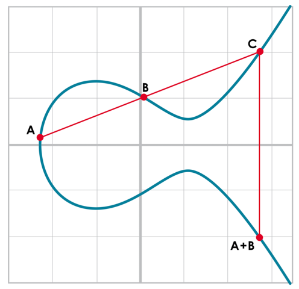
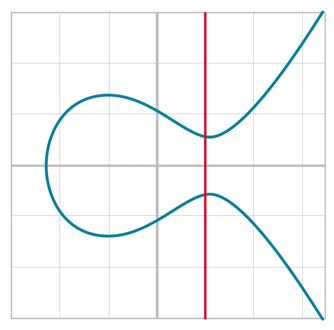
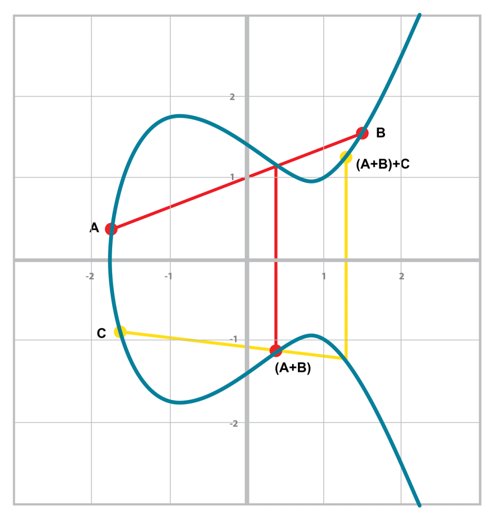
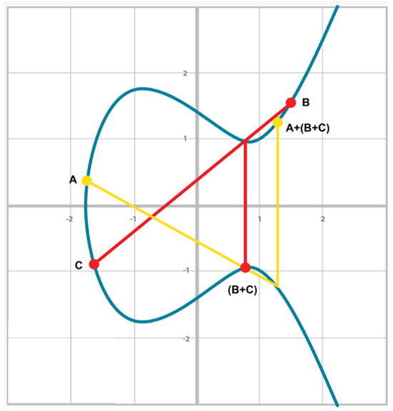

# Elliptic Curve Algebra

Elliptic curves are curves defined by the following equation:

`y² = x³ + ax + b`

They are like cubical equation, but they smooth around the origin of the `x` and they are 
symmetric due to the quadratic value of the `y`.

## ECPoint

Is a point which lives in a specific Elliptic Curve and is defined as:

```dart
class ECPoint {
  final BigInt x;
  final BigInt y;
  final BigInt a;
  final BigInt b;
  
  ECPoint(this.x, this.y, this.a, this.b) {
    assert(y.pow(2) == x.pow(3) + a*x + b);
  }
}
```

##Properties of EC

*EC*s have the nice property that a line will in general intersect with an *EC* in either 1 or 3.
It will intersect in 2 points only when:
- When The line is parallel to the `y-axis`.
- When the line is tangent to the curve.

## Point Addition on ECs

We can define the 'point addition' in a specific *EC* as given 2 points in the Curve A and B, we identify the third interesected point C, we find its symmetric respect the `y-axis`, that will be the `A+B` point.



We first draw a line through the two points we’re adding (A and B). The third inter‐
section point is C. We then reflect that point over the x-axis, which puts us at the A +
B point in Figure.

One of the properties that we are going to use is that point addition is not easily predictable. We can calculate point addition easily enough with a formula, but intuitively,
the result of point addition can be almost anywhere given two points on the curve.

Going back to Figure, `A + B` is to the **right** of both points, `A + C` would be some‐
where **between** `A` and `C` on the x-axis, and B + C would be to the **left** of both points.
In mathematics parlance, point addition is *nonlinear*.

### Properties

The *Point Addition* satisfies the following properties:

- *Identity*
- *Commutativity*
- *Associativity*
- *Invertibility*

#### Identity

It exists a **Point I** such as added to a generic *Point A*:

`I + A = A + I = A`

We call the **Point I** *Identity* or *Point At Infinity*

#### Invertibility

The **Identity Point** respect the *Invertibility* property such as:

> if `I + A = A` then it must exists an *Inverse of the Point A* indicated as **(-A)** such as:
> `A + (-A) = (-A) + A = I`

Visually these **Points** are symmetrically one to the another respect the 'x-asis' and identified by
a vertical line intercepting the curve.

We assume this vertical line intersect the curve on a third point at *Infinity*, for this reason
we also call the *Identity* also as *Point at Infinity*.



#### Commutativity

Given 2 generic points in the curve A and B then is also true the below:

`A + B = B + A = C`

Given 2 points defined in the curve: `A` and `B`, independently of their order
the line associated will intercept always the curve on a same point `C`.

#### Associativity

Given 3 points defined in the curve `A, B and C`, it doesn't matter the order we process
the addition the result, will always be the same:

> ```(A + B) + C = A + (B + C) = A + B + C```

> **'(A + B) + C'**
> 
> 
> 
> - We start with the *red line*, defined `A` and `B`, we identify the 3rd point which intercepts the curve, and we get its inverse as the point `(A+B)`
> - We define a new line with the 2 points `C` and `(A+B)` and we get the inverse of the point intercepted, this will be our final result
> `(A + B) + C`

> **'A + (B + C)`**
> 
> 
> 
> - We start with the *red line*, defined the point `B` and `C` we obtain the `(B + C)` point
> - Given the 2 points `A` and `(B + C)` we define a new line and derive the new point `A + (B + C)`. 


> **Note**
> 
> If the addition wouldn't take the inverse of the 3rd point intersected by the line defined by the point A and B
> it wouldn't be possible to have the *Associativity* property.

