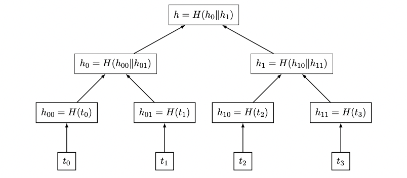
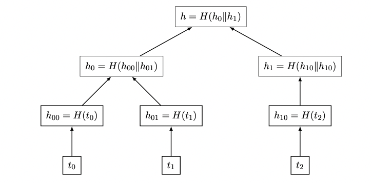

# Blockchain

## Introduction

The blockchain is the database containing a record of all the bitcoin transactions since Bitcoin came to the existence in 2009.
It is a _linear_ list of _blocks_ where each blocks is composed of _block header_ followed by a list of _transactions_.

### Rewarding Blockchain Updation

The task of storing and updating the blockchain, is performed collectively by the nodes in the P2P Bitcoin network.

Nodes called _full nodes_, stores a copy of the full blockchain on their disks.
When a _full node_ connects for the first time to the network, it will download the blockchain from the other existing _full nodes_.

The task of adding new blocks to the blockchain is called _mining_ and is performed by _full nodes_ called _miners_.
The naming convention for _mining/miners_ was chosen because the _mining_ task, involves the solution to a difficult computational problem, and a _miner_ which successfully solves such a problem is rewarded with _newly created bitcoins_.

This reward is called the _block subsidy_ and as per September 2023, is currently equal to 6.25 bitcoins per block. In addition to the _block subsidy_, *miners* also receive _transaction fees_ in bitcoins which are provided by the transactions in the block being added. The sum of the _block subsidy_ and the _transaction fees_ is called the _block reward_.

> Mining is the only way new bitcoins are created in the Bitcoin system.

The computational difficulty of mining a single block is adjusted by the network to ensure that a new block is added approximately every 10 minutes.

### Block Header

| Field          | Size     | Format notes                   |
|----------------|----------|--------------------------------|
| nVersion       | 4 Bytes  | little endian                  |
| hashPrevBlock  | 32 Bytes |                                |
| hashMerkleRoot | 32 Bytes |                                |
| nTime          | 4 Bytes  | Unix timestamp, little endian? |
| nBits          | 4 Bytes  | Obtained by Network.nBits      |
| nNonce         | 4 Bytes  | Generated by the miner         |

Every block in the Blockchain starts with an 80 Bytes header block.

In the following section we will describe the meaning of each field that compose the block header.

#### nVersion

The _Block Header_ begins with a 4 Bytes field _nVersion_ which specifies the version of the block.
As the blockchain evolved, changes were proposed to fix bugs of enable new features. The version number of the block, indicates which features are supported by the transactions within the current block.

For historical reason, the version number is an int32 (4 Bytes) number serialised using the little endian notation, this means that to represent the version number 1, the little endian HEX representation will be: **0x01000000**, instead of the canonical big endian value: 0x00000001 (int: 1).

### hashPrevBlock

Each block has an identifier, which is obtained by the double SHA-256 hash of its **block header**.
This is called the _block header hash_ of the block.

Each _block header_ contains the identifier of the previous block, this is the way we chain the blocks in the blockchain.

### hashMerkleRoot

The **hashMerkleRoot** field stores the root hash of a Merkle tree formed using the transactions in the block. The transactions are arranged as a list of double SHA256 hash fo each of is computed. Using these hashes as leaves,
a binary tree is created where each node is associated with a double SHA256 hash of the concatenation of its child hashes.

Assuming we have 4 transactions in our block (t0, t1, t2, t3), the **Merkle Hash Root** is obtained as demonstrated by the below figure:

When you have an odd number of transactions in your block (i.e.: t0, t1, t2) the **Merkle Hash Root** is obtained as per below figure:

> **H** is the hasing function used: `sha256(sha256(value))`

> **NOTE**
> 
> The root hash stored in **hashMerkleRoot** is a compact representation of _all the transactions in a block_. Any change to a transaction in a block will result in a change in the **hashMerkleRoot** field as the SHA-256 function is collision resistant. A change in the **hashMerkleRoot** will in turn result in a change in the _block hash_ of the block. The _block hash_ of a block also depends on the **hashMerkleRoot of the previous block** through the _hashPrevBlock_. 
> As this dependence is _recursive_, the block hash of a particular block depends on **all the transactions in all the previous blocks all the way upto the genesis block**.

**But why use a Merkle tree of the transactions? Why not hash the concatenation of all the transactions and put the resulting hash in the block header?**

The reason for using the Merkle root is that it enables efficient membership proofs of transactions within a block.

### nTime, nBits, nNonce

All these 3 fields in the block header are related to mining.

#### Mining

Mining is the process by which new blocks are added to the blockchain. Each block consists of a _block header_, followed by the list of transactions.
The list always begins with a special transaction called the _coinbase transaction_ which encodes the transfer of the _block reward_ (_block_subsidy_ plus the transaction fees from the other transactions)
to the miner which added the block to the blockchain.

* Each _coinbase transaction_ involves the creation of new bitcoins.
* The other transactions in the list are called _regular transactions_ and they encode the transfer of bitcoins which were created in some previous block.

> The maximum number of regular transactions in a block is limited by the block size which was 1 MB until August 2017 and 4 MB after that

Nodes which want to record new regular transaction sin the blockchain broadcast them on the Bitcoin network.
When other nodes hear these new transactions, they add them to a transaction _memory pool_ (_mempool_) which is stored in local memory (RAM).
A _miner node_ includes a coinbase transaction in the candidate block which transfers the block reward to its own Bitcoin address. There will be several mine nodes competing to add the next block in the blockchain and claim the resulting block reward.
The candidate blocks created by these different miner nodes will differ in the coinbase transaction, as each node will insert its own Bitcoin address as recipient of the block reward.
The candidate blocks may also differ in the regular transactions included in them as different miner nodes may have different sets of transactions in their respective mempools. This may be due to the miner nodes
receiving transactions broadcasted on the Bitcoin network at different times de to network latencies.

Each block in the blockchain has an associated _height_ which represents its current index in the chain.
The very fist block, called the genesis block, had the index 0, any following block has the height of the previous block + 1.

When a miner creates a new block to append, it includes in the header a field **nTime**, which is the unix timestamp representation
(number of seconds since 12:00 UTC from January 1st, 1970). Because each miner is using a local clock to create the timestamp, there isn't a universal concept of time,
for a block to be valid is required that the **nTime** of the block is strictly greater than the **nTime** of the previous block.

The **nBits**, is an exponential representation and is used to calculate the _target threshold value_, this is a 256 bits unsigned integer, using a base 256 version of the scientific notation.
Let nBits be formed by the following 4 bytes: (b1, b2, b3, b4), b1 plays the role of the exponential value and the concatenation of [b2, b3, b4] are called the mantissa.
The Target Threshold is calulated as below:
 
> nBites = (b1, b2, b3, b4)
> 
> T = Target Threshold
> 
> > T = [b2, b3, b4] * 256^(b1-3)
> 
>  | nBits      | Target Threshold | b1 - 3 |
>  |------------|------------------|--------|
>  | 0x03123456 | 0x123456         | 0      |
>  | 0x02123456 | 0x1234           | -1     |
>  | 0x05123456 | 0x12345600000    | 2      |
>  | 0x08123456 | 0x123456000000   | 5      |

> **The goal of the miner is to find a candidate block whose block hash is less than or equal to the target threshold.**
> 
> The minimum value of the nBits to be used for a block is dictated by the Bitcoin network (Mainnet, testnet etc...). The lower is the target threshold, the faster the block is propagated.

The miner is free to set  the **nNonce** field to any value, in order to find a _block hash_ which is smaller than the _Target Threshold_.