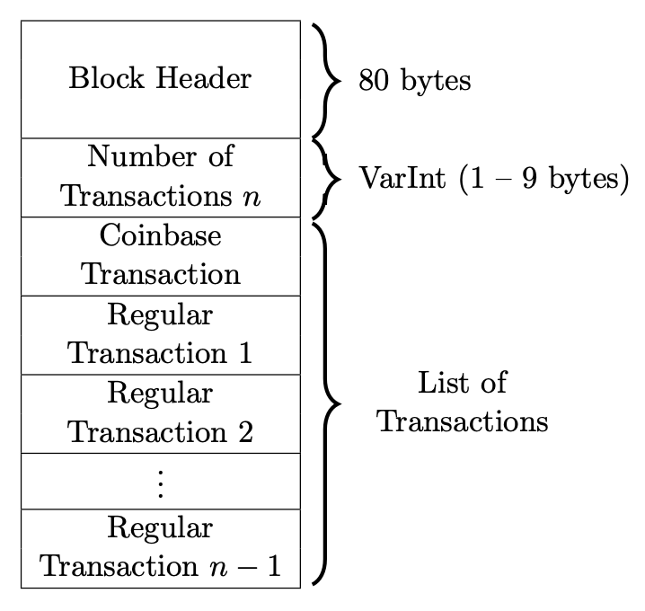
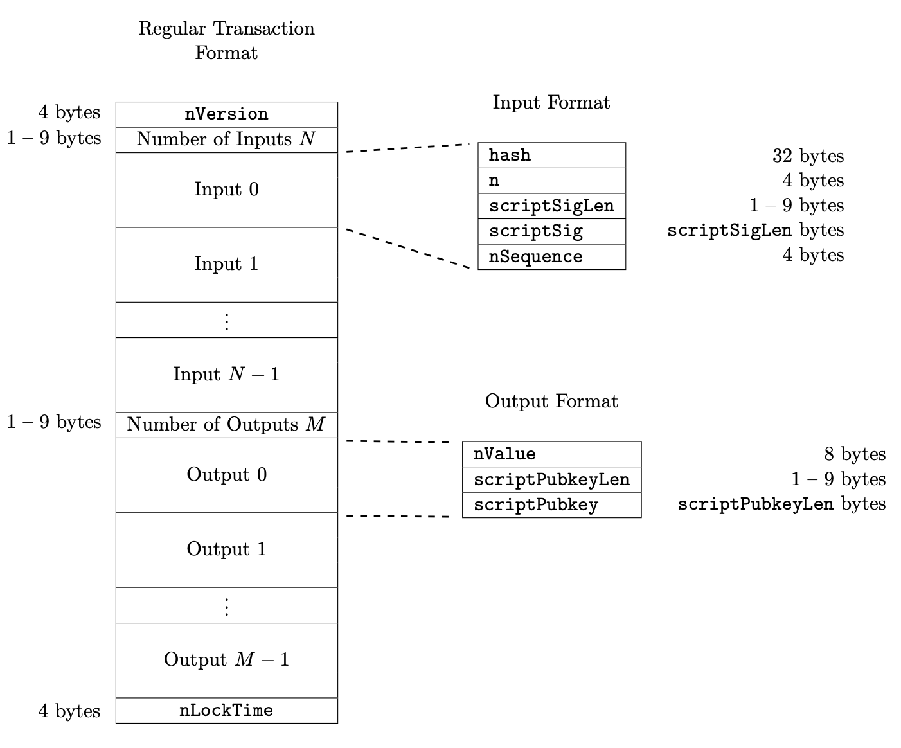

# Bitcoin Transaction

## Introduction

In this section we will present and explain the structure of a Bitcoin Transaction.

The original Transaction format introduced on 2009 was valid until August 2017, when a set
of changes were introduced to the Bitcoin protocol called Segregated Witness (SegWit).

SegWit added a new transaction format to solve the problem of _transaction malleability_ which affected
the original format.

The original transaction format is still supported even after the introduction of the _SegWit_, and we
refer to the original format as _pre-SegWit_ transaction type.

## Block Format

Each block in the blockchain is composed by:

* 80 Bytes containing the [_block header_](Blockchain.md#block-header)
* VarInt representing the length of the transactions with the _Coinbase Transaction_ always occupying the first position.

Each of the regular transactions in a block can be either a _pre-SegWit_ or a _SegWit_ transaction.

If all the regular transactions are _pre-SegWit_ transactions then the _coinbase transaction_ also adheres to the _pre-SegWit_ transaction format.
Otherwise, the _coinbase transaction_ adheres to the _SegWit_ transaction format.

## Pre-SegWit Transaction

| Field Name  | Size    | Description                                                                                                                                                                                                                                                                             |
|-------------|---------|-----------------------------------------------------------------------------------------------------------------------------------------------------------------------------------------------------------------------------------------------------------------------------------------|
| nVersion    | 4 Bytes | The version number dictates the rules for interpreting the fields in a transaction. As of August 2017, the transaction version number can be either 1 or 2. The two versions differ in the interpretation of the **nSequence** field in the transaction inputs (to be discussed later). |
| Input List  | VarInt  | VarInt encoding of the number of inputs N. This field is followed by the N inputs.                                                                                                                                                                                                      |
| Output List | VarInt  | Number of outputs M stored as a VarInt, which in turn is followed by the M outputs.                                                                                                                                                                                                     |
| nLockTime   | 4 Bytes | It stores a _lock time_ for the transaction which is the earliest time that the transaction can be included in a block on the blockchain.                                                                                                                                               |

> If all the **nSequence** field in the _Input Transactions_ are set to `0xffffffff`, then the nLockTime field is ignored by the miner and can be defaulted to any value (0x00000000).

## SegWit Transaction

